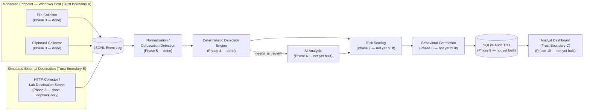

# PHASE 0 — THREAT MODEL

## 🎯 Objective

Define what this platform protects, against whom, under what assumptions, and
how "done" is measured — **before** any detection logic is written. Every
later technical decision (which detectors exist, what "risk" means in Phase 7,
what counts as project-complete in Phase 18) traces back to a requirement
defined here. This phase produces no code; it produces the requirements
Phases 3-5 (already implemented) were built against, and the standard the
implementation is checked against at the end of this document.

## 🧠 Concept

**DLP (Data Loss Prevention)** and **insider threat detection** are related
but distinct disciplines, combined deliberately in this project:

- DLP asks: *"is this specific piece of content sensitive?"* — a
  content-inspection problem. Phases 4-5 answer this.
- Insider threat detection asks: *"is this specific person's behavior, over
  time, consistent with data theft?"* — a behavioral/pattern problem. Phase 8
  will answer this, built on top of the DLP layer's output.

A platform that only does content inspection catches "a credit card number
just left the building" but not "this user has quietly touched every
customer file in the finance share over the past three days." Combining both
is what real insider-risk programs do, and it is why the architecture has
both a content-detection layer (Phase 4/5, done) and a correlation layer
(Phase 8, later).

**Scope discipline (ties to the project's ethical constraints):** this is a
defensive, single-operator lab. It uses synthetic data exclusively, performs
no real exfiltration (the "external" destination is a local server that never
leaves loopback — enforced in code, not just policy, in
`collectors/http_collector.py`), and does not build or reference any
offensive/malware tooling. The goal is to demonstrate detection engineering
skill, not to build a surveillance product — see "Lab Limitations" below for
where this project deliberately stops.

## 🏗️ Architecture

**Trust boundaries:**

| Boundary | What separates | Why it matters |
|---|---|---|
| A — Endpoint | The monitored Windows host vs. everything else | This is the boundary Phase 3's collectors instrument. Everything observed originates here. |
| B — External destination | "Internal/legitimate" vs. "external/uncontrolled" | Modeled entirely by the local HTTP test server. No traffic ever crosses a real network boundary — see `run_server()`'s loopback guard in `collectors/http_collector.py`. |
| C — Analyst access | Whoever can read the audit trail / dashboard vs. everyone else | Not implemented until Phase 9/10, but flagged now so those phases don't get built ignoring access control as a requirement. |

## Assets (synthetic representations of)

1. Customer PII — names, SSNs, dates of birth, addresses
2. Payment card data — PAN, expiry, brand
3. Financial / payment messages — SWIFT/BIC codes, wire instructions
4. Credentials and secrets — cloud API keys, private keys, VCS/chat tokens
5. Proprietary source code and "confidential" marked documents
6. Strategic/M&A material — deal terms, board decks

## Threat actors

| Actor | Description | Example scenario |
|---|---|---|
| Malicious insider | Intentional data theft or sabotage | A departing employee exports the customer list before resigning |
| Negligent insider | Unintentional exposure, no bad intent | Pastes a customer export into a personal chat app out of habit |
| Compromised insider | External attacker operating through a legitimate employee's session | Indistinguishable from a malicious insider at the DLP layer — a documented, real limitation of this entire class of tooling, not something this project claims to solve (see Lab Limitations) |

## Insider-threat / exfiltration scenarios

These define **what the platform must be able to see**; they become the
concrete test scenarios in Phase 11.

| ID | Scenario | Primary detector(s) exercising it |
|---|---|---|
| S1 | Bulk customer data export before resignation | `keyword_detector` (customer_data), `filetype_detector` |
| S2 | Payment card data pasted into external chat/webmail | `card_detector` via clipboard/HTTP collector |
| S3 | Credential/secret leaked into chat or a paste site | `secret_detector` |
| S4 | Proprietary source code exfiltrated via personal email/cloud | `keyword_detector` (source_code_markers), `filetype_detector` |
| S5 | Data obfuscated (renamed extension, base64, zipped) before exfil | `normalization/normalizer.py` (Phase 5), `filetype_detector`'s magic-byte mismatch check |
| S6 | Anomalous timing/volume (e.g. large export at 2am, or pre-offboarding) | Not a content signal — this is Phase 8's behavioral correlation, noted here as a requirement driver |

## Detection requirements

| ID | Requirement | Status |
|---|---|---|
| DR1 | Detect unencoded payment card numbers, brand-identified, Luhn-validated | ✅ Implemented — `detectors/card_detector.py` |
| DR2 | Detect SWIFT/BIC codes and MT-style payment-message structures | ✅ Implemented — `detectors/swift_detector.py` |
| DR3 | Detect common credential/secret formats without ever persisting the raw secret | ✅ Implemented — `detectors/secret_detector.py` (fingerprint-only evidence) |
| DR4 | Detect configurable sensitive keyword/category content | ✅ Implemented — `detectors/keyword_detector.py` + `config/detection_policy.yaml` |
| DR5 | Detect sensitive file types by extension AND content, catching renamed-extension evasion | ✅ Implemented — `detectors/filetype_detector.py` |
| DR6 | Detect base64 / URL-encoding / JSON-embedding / compression obfuscation, recursively | ✅ Implemented — `normalization/normalizer.py` |
| DR7 | Escalate ambiguous content to AI review rather than relying on regex alone | ⏳ Phase 6 (not yet built) — the hook (`needs_ai_review()`) already exists in `detectors/engine.py` |
| DR8 | Produce a single blended risk score from deterministic + AI signals | ⏳ Phase 7 (not yet built) |
| DR9 | Correlate multiple low-signal events into a higher-confidence behavioral pattern | ⏳ Phase 8 (not yet built) |

## Security assumptions

- **A1.** The lab runs on a single-user Windows laptop under the operator's
  full control. There is no adversary with independent, concurrent access to
  the host during testing — this project defends against *what a user does*,
  not against *an attacker who already has a foothold on the box*.
- **A2.** All sensitive data used anywhere in testing is synthetic. Where a
  "realistic" value is needed, only publicly-documented example/test values
  are used (e.g. AWS's own published example access key, the standard
  payment-industry test card numbers) — never real, real-looking-but-private,
  or randomly-generated-but-plausible data.
- **A3.** The simulated "external" destination is always the local test
  server; no traffic ever leaves the loopback interface. This is enforced
  technically (`run_server()` refuses to bind non-loopback), not only by
  policy.
- **A4.** The Windows OS, its account model, and the Python runtime are
  trusted. This project does not defend against OS-level compromise, kernel
  rootkits, or an attacker with physical access to the device.

## Lab limitations (explicit, non-exhaustive)

- **Pattern-based ceiling.** Deterministic detectors miss sensitive data that
  matches no known pattern and no policy keyword (e.g. a customer list with
  no SSNs/card numbers and no configured keyword hit). This is precisely why
  an AI review layer (Phase 6) exists — but even that will not be
  exhaustive, and should not be marketed as such in the portfolio write-up.
- **No kernel-level hooking.** Everything is user-space (Python, `watchdog`,
  `pyperclip`, Flask). A sufficiently technical malicious insider could
  write data through a path this project does not observe. This is
  documented, not solved, here.
- **Correlation will be heuristic, not a full UEBA product.** When Phase 8
  is built, its false-positive/false-negative rates should be reported
  honestly (Phase 12), not oversold.
- **Single host, no SIEM integration.** This is a portfolio-scale lab, not a
  multi-endpoint enterprise deployment. Worth naming explicitly as "future
  work" in the final write-up (Phase 18) rather than silently ignoring it.
- **The tool's own output is a new asset.** The event log / future database
  is itself sensitive (it contains detection evidence about real activity
  once deployed anywhere real). This is why secrets are fingerprinted rather
  than logged raw (`detectors/secret_detector.py`) and cards are masked to
  PCI-DSS 3.3/3.4 style (`detectors/card_detector.py`) — decisions made
  *because of* this threat-modeling step, not incidentally.

## 📌 Completion Criteria

- [x] Assets, actors, and scenarios documented (this file)
- [x] Trust boundaries diagrammed
- [x] Detection requirements DR1-DR9 listed, each traceable to an owning phase
- [x] Assumptions and limitations stated explicitly, not left implicit
- [x] Cross-checked against the actual Phase 4/5 implementation: DR1-DR6 are
      verified satisfied by the 79 passing tests in `tests/` (see
      `docs/DETECTION_ENGINE.md` and `docs/NORMALIZATION.md` for the
      per-requirement test evidence)

**Do not proceed to relying on Phase 1 environment setup until this file has
been read and the scenarios table (S1-S6) makes sense to you** — Phase 11's
test scenarios (a later phase) will be a direct elaboration of this table,
and Phase 7's risk-scoring weights (also later) will reference these asset
categories by name.
